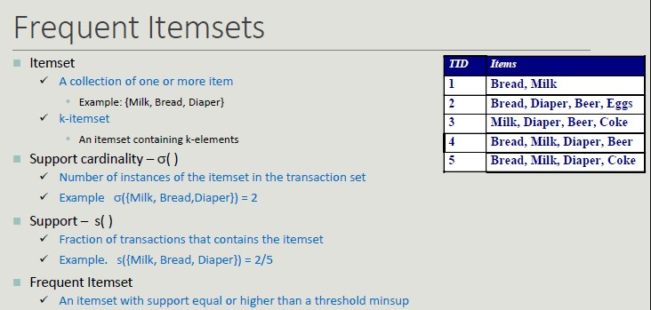

# Association Rule

The idea of association rule is **basket analysis**.
We have a set of transactions (set of elements coming from a huge set).

A classic example of association rule coming from *data mining literature* is the association {Diaper} -> {Beer}

## Applications

- Marketing sales promotion (understand which products could be affected in the event that the store interrupted the sale of a specific product)
- Arrangement of goods (to identify the products bought together by a sufficiently large number of costumers)

**Problem Formulation**

Given a set of transactions T, you want to find all transactions such that:

- Support >= *minsup*
- Confidence >= *minconf*

**Naive Approach:**

- Lists all possible association rules
- For each rule calculates support and confidence
- Eliminate rules that do not meet thresholds for *minsup* and *minconf*

All rules are binary partitions of the same itemset: {Milk, Diaper, Beer} and rules based on the same itemset have the same support but they may have different confidence.

Searching association rules follow a two-steps approach:

1. Generate **frequent itemsets**
2. Rule generation (for each itemset, generate the rules with high confidence. Each rule is a binary partitioning of the elements in the itemset)

## Frequent Itemsets Generation

Frequent itemsets can be identified following the **apriori principle:**

If an itemset is frequent, then all its sub-sets must be frequent too.

- The support of an itemset does not exceed the support of its subsets
- This is known as the anti-monotonic property of the support

A frequent itemset is **maximal** if no one of its adjacent superset is frequent.
On the other hand, an itemset is **closed** if none if its adjacent superset has the same support.

**Closed vs Maximal itemsets**

From an efficiency point of view:

- They provide a more compact representation than frequent ones, which is relevant when space is an issue.
- Only closed itemsets determine a lossless compression of frequent patterns, which contain complete information regarding the frequent itemsets but closed itemsets are fewer in number than frequent itemsets.
- From the semantic point of view, maximal itemsets are the most complex while closed ones can be interesting if they are supported by groups with largely different support

