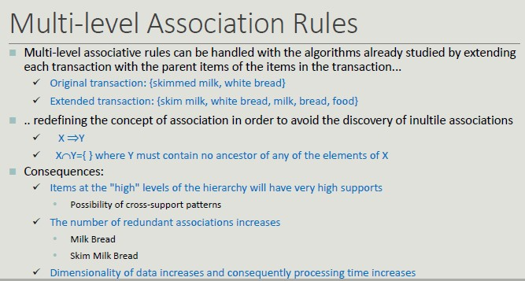

# Association Rule

The idea of association rule is **basket analysis**.
We have a set of transactions (set of elements coming from a huge set).

A classic example of association rule coming from *data mining literature* is the association {Diaper} -> {Beer}

## Applications

- Marketing sales promotion (understand which products could be affected in the event that the store interrupted the sale of a specific product)
- Arrangement of goods (to identify the products bought together by a sufficiently large number of costumers)

**Problem Formulation**

Given a set of transactions T, you want to find all transactions such that:

- Support >= *minsup*
- Confidence >= *minconf*

**Naive Approach:**

- Lists all possible association rules
- For each rule calculates support and confidence
- Eliminate rules that do not meet thresholds for *minsup* and *minconf*

All rules are binary partitions of the same itemset: {Milk, Diaper, Beer} and rules based on the same itemset have the same support but they may have different confidence.

Searching association rules follow a two-steps approach:

1. Generate **frequent itemsets**
2. Rule generation (for each itemset, generate the rules with high confidence. Each rule is a binary partitioning of the elements in the itemset)

## Frequent Itemsets Generation

Frequent itemsets can be identified following the **apriori principle:**

If an itemset is frequent, then all its sub-sets must be frequent too.

- The support of an itemset does not exceed the support of its subsets
- This is known as the anti-monotonic property of the support

A frequent itemset is **maximal** if no one of its adjacent superset is frequent.
On the other hand, an itemset is **closed** if none if its adjacent superset has the same support.

**Closed vs Maximal itemsets**

From an efficiency point of view:

- They provide a more compact representation than frequent ones, which is relevant when space is an issue.
- Only closed itemsets determine a lossless compression of frequent patterns, which contain complete information regarding the frequent itemsets but closed itemsets are fewer in number than frequent itemsets.
- From the semantic point of view, maximal itemsets are the most complex while closed ones can be interesting if they are supported by groups with largely different support

## Rule Generation

Given a frequent itemset L, find all the non-empty subsets f ⊂ L such that f -> L - f that fulfills the minimum confidence constraint.

The confidence measure does not have the property of anti-monotonicity with respect to the overall associative rule.
However, it is possible to take advantage of the anti-monotonicity of the confidence with respect to the left-hand side of the rule.

## Interestingness

The **objective measure** is to prioritize rules based on statistical criteria calculated from data.
The **subjective measure** is to prioritize rules based on user-defined criteria.

According to the latter, a patter is interesting if:

- It contradicts the users' expectations
- The user is interested in performing some activities or making decisions regarding its elements

## Dataset Support

**Inhomogeneous Support**

Many datasets have itemsets with very high support along with others with very limited support.
A large commerical chain sells products with price ranges from €1 to €10,000. The number of transactions that include products with low price is much higher than those with high price. However, the associations among them are of interest of the company.

Setting the *minsup* threshold fot these datasets can be very difficult.

**Cross-support Pattern**

A cross-support pattern is an itemset x = {i...1n} where the support ratio r(x) is lower than a threshold *thr*.

## Confidence Limits

The case of cross-support patterns has shown the limits of support.

The confidence limitations is due to the fact that it does not consider the itemset support in the right.hand side of the rule and therefore, it does not provide a correct assessment in the case where the item groups are not stochastically independent.

The **lift** value of an association rule is the ratio of the confidence of the rule and the **expected confidence** of the rule.

## Handling Categorical and Continuous Attributes

In its basic formulation, association rule works with binary and asymmetric variables.

**Binarization** is needed to transform categorical attributes into asymmetric binary attributes by introducing a new item for every possible attribute value.

Association rules that include attributes with continuous values are called **quantitative association rules.**
Continuous attributes can be handled through several approaches:

- Based on discretization
- Based on statistics
- Without discretization 

The discretization poses the problem of how to fix the number and the border ranges.
The number of intervals is usually supplied by the users and can be expresses in terms of:

- Range of intervals (equi-distant discretization)
- Average number of transactions per interval (equi-depth discretization)
- Cluster number

The choice of the width of the intervals affects the value of support and confidence:

- Too large intervals reduce confidence
- Too narrow intervals reduce support and tend to determine replicated rules

One possible solution is to try all possible intervals (brute force).

## Multi-level Association Rules

A hierarchy of concepts composed by generalization based on the semantics of its elements.

The higher the level, the higher the support, leading to **generic rules**.

Hierarchies of concepts are incorporated for the following reasons:

- Rules at the lower levels may not have sufficient support to appear in frequent itemsets
- Rules at lower levels may be too specific

Multi-level associative rules can be handled with the algorithms already studied by extending each transaction with the parent items of items in the transaction.

Adding details (skimmed milk, white bread) does not add any value and increases complexity.

