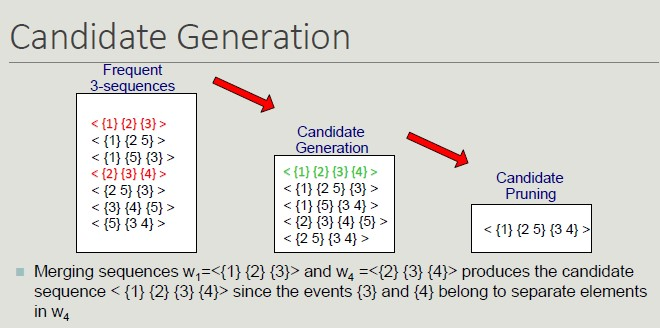

# Sequential Pattern

Often, temporal information is associated with transactions, allowing events concerning a specific subject to be linked together.

A **sequence** is an ordered list of elements, each of which contains a set of events (items).
Each item is associated with a specific time instant or ordinal position.

The length of the sequence is given by the number of elements in it.

## Sub-sequence

We have sequences (like ordered purchase list from the same customer) and **sub-sequences** are sequences contained in a sequence where the mapping respects the order.

The support of a sub-sequence w is defined as the fraction of sequences that contain w.

**Mining Sequential Pattern**

Given a database of sequences and a minimum support threshold, *minsup* find all subsequences whose support is >= *minsup*

**Apriori Principle** can be applied to sequential pattern mining since any sequence s that contains a particular k-sequence must contain all (k - 1) subsequences of s.

The steps to follow in this process, include:

1. Run an initial scan of the sequence DB to locate all 1-sequence
2. Repeat until new frequent sequences are discovered
    - Candidate generation: find pairs of frequent subsequences found in step k-1 to generate candidate sequences containing k items
    - Candidate pruning: eliminate k candidate sequences that contain (k-1) subsequences that are not frequent
    - Support counting: scan the DB to find the support of candidate sequences
    - Candidate elimination: eliminate candidate k-sequences whose support is actually less than *minsup*

Searching for sequential patterns is a difficult problem given the exponential number of subsequences contained in a sequence.

## Temporal Constraints

Temporal constraints increase the expressiveness of sequential pattern by better defining their structure.

- **MaxSpan** defines the maximum time interval between the first and the last sequence element
- **MinGap** defines the minimum gap between events belonging to two different elements
- **MaxGap** defines the maximum gap between events belonging to two consecutive elements

**Sequence Mining with Temporal Constraints**

Temporal constraints impact on sequence supports as some patterns counted as frequent may not be true because some of the sequences in their support may violate a time constraint.

It is necessary to modify the counting technique to account for this problem.

The **Time Window Size** (ws) conversely relaxes the support basic definition as it specifies the interval within which two events occurring at different times should be considered simultaneous.