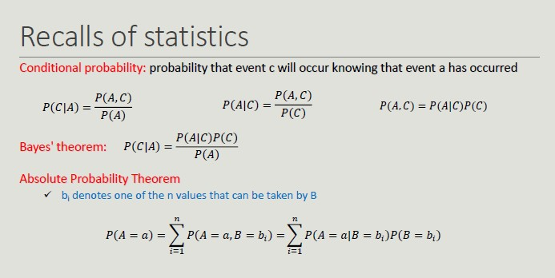
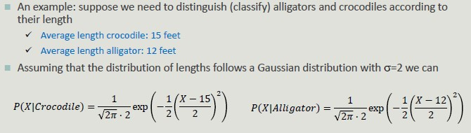

# Bayesian Classifier

It is a probabilistic approach to solving classification problems.
In many applications, the relationship between attribute values and that of the class is not deterministic, due to noise data, hidden variables and difficulty in quantifying certain aspects.

- **Uncertainty about the outcome prediction**

Bayesian classifier model probabilistic relationships between attributes and the classification attribute.

## Naïve Bayes

The main advantage of probabilistic reasoning over logical reasoning lies in the possibility of arriving at rational descriptions even when there is not enough deterministic information about how the system works.

This classifier is **robust** toward irrelevant attributes. 

It provide optimal results if:

- The conditional independence condition is met
- The probability distributions of P(X|Y) are known

13.5 is the solution that minimizes the error.

## Probability with Continuous Attributes

In case attribute A is continuous, it is not possible to estimate probability for each of its values.

We need to **discretize** the attribute into intervals by creating an ordinal attribute.
If too many intervals are used, the limited number of training set event per interval makes the prediction unreliable. 

We **associate** the attributes with a density function and estimate the parameters of the function from the training set to estimate P(A|C).

