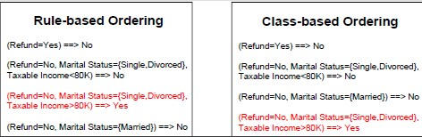
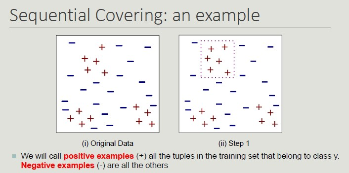
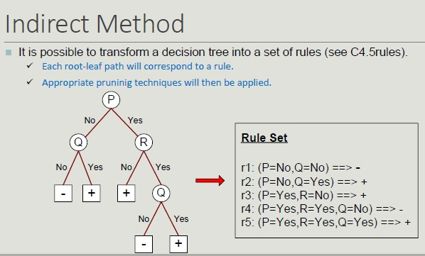

# Rule-Based Classifier

The basic idea is to classify records using rule sets of the type "*if .. then*". The condition used with 'if' is called the antecedent while the predicted class of each rule is called the consequent.

A rule has the form: (condition) -> y

Building a model means identifying a set of rules


## Coverage and Accuracy

We can have very accurate rules but with low coverage, which is not that relevant.
Given a dataset D and a classification rule A -> y, we define:

- **Coverage** as the portion of records satisfying the antecedent of the rule
    - Coverage = |A|/|D|
- **Accuracy** as the fraction that, by satisfying the antecedent, also satisfy the consequent
    - Accuracy = |A ∩ y|/|A|

A set of rules R us said to be **mutually exclusive** if no pair of rules can be activated by the same record.

A set of rules R has **exhaustive coverage** if there is one rule for each combination of attribute values.

## Properties

- It is nt always possible to determine an exhaustive and mutually exclusive set of rules
- Lack of mutual exclusivity
- Lack of exhaustiveness

## Rule Sorting Approach

1. Rule-based sorting (individual rules are sort according to their quality)
2. Class-based sorting (groups of rules that determine the same class appear consequently in the list)



## Sequential Covering

```python
set R = Ø
for each class y ∈ Y 0 y k do
    stop=FALSE;
while !stop do
    r = Learn One Rule(E,A,y)
    remove from E training records that are covered by r
    If Quality(r,E ) < Threshold then
        stop=TRUE;
    else
        R = R ∪ r // Add r at the bottom of the rule list
end while
end for
R = R ∪ {{} -> y k } // Add the default rule at the bottom of the rule list
PostPruning (R);

```


## Dropping instances from Training Set
Deleting instances from the training set serves the purpose of:

- Properly classified instances: to avoid generating the same rule again and again, avoid overestimating the accuracy of the next rule
- Incorrectly classified instances: to avoid underestimating the accuracy of the next rule


## Learn-One-Rule

We want something that is general (even with a lower accuracy). The goal of the algorithm is to find a rule that covers as many possible examples and as few as possible negative examples.

Rule are constructed by progressively considering a new possible predicate.

- In order to choose which predicate to add, a criterion is needed:
    - n = number of instances covered by the rule
    - nr = number of instances properly classified by the rule
    - k = number of classes

**Accuracy(r) = nr/n**

Some metrics (like the **FoilGrain**) supports the rule by identifying the number of positive examples covered by the rule.

**Stop Criterion**: as soon as the rule is not relevant anymore, stop it.

**Rule Pruning**: it aims at simplifying tules to improve rule generalization error.
It can be useful given that the construction approach is greedy.

*example: remove the predicate whose removal results in the greatest improvement in error rate on the validation set*

## The RIPPER Method

It is an approach based on sequential covering for 2-class problem and it is used to choose one of the classes as a positive class and the other as a negative class.

the idea is to compute the description length (cost for transmitting the data set from one user to another) and if it exceeds the threshold, we should sthop.




