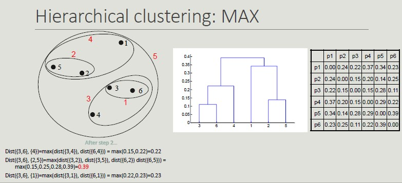
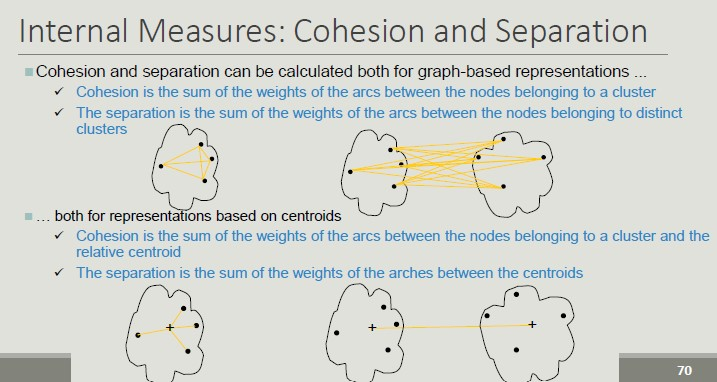

# Clustering

Clustering analysis aims at finding groups of objects such that objects that belong to the same group are more similar to each other than objects belonging to different groups.

Clustering is NOT supervised classification (it assumes classes to be known) or segmentation (partition rule is given) or querying a database (the selection and grouping criteria are given).

## Types of clustering

We can distinguish between:

- **Partitioning clustering**: a division of objects into non-overlapping subsets (clusters), in which each object belongs exactly to a cluster.
- **Hierarchical clustering**: a set of nested clusters organized as a hierarchical tree.
- **Exclusive vs non-exclusive**: in non-exclusive clustering, points can belong to multiple clusters.
- **Fuzzy vs non-fuzzy**: in a fuzzy clustering a point belongs to all clusters with a weight between 0 and 1.
- **Partial vs complete**: in a partial clustering, some points may not belong to any of the clusters.
- **Heterogeneous vs homogeneous**: in a heterogenous cluster, clusters can have very different sizes, shapes and densities.

Similarly, we can identify different types of **clusters**:

- **Well-separated clusters**: each point in the cluster is closer (more similar) to any other point in the cluster than any other point that does not belong to the cluster.
- **Center-based clusters**: a point in the cluster is closer to the *center* of the cluster, rather than to the center of each other cluster.
    - Cluster center = **centroid**
- **Contiguous clusters** (nearest neighbor): a point in a cluster is closer to one or more other points in the cluster than to any point not in the cluster.
- **Density-based clusters**: a cluster is a dense region of points, which is separated by low-density regions from other regions of high density.
- **Conceptual clusters**: clusters with shared properties or in which the shared property derives from the whole set of points.

## K-means Clustering


Initial centroids are often chosen randomly (clusters produced vary from one run to another).


## Converge and Optimality

There is only a finite number of ways to partition n records into k groups.
So, there is only a finite number of possible configurations in which all the centers are centroids of the points they possess.

If there are K real clusters, the probability  of choosing a centroid from each cluster is very limited.

Some solutions to this problem, include:

- Run the algorithm several times with different centroids.
- Perform a sampling of the points and use a hierarchical clustering to identify k initial centroids.
- Select more than k initial centroids and then select the ones to use from these.
- Use post-processing techniques to eliminate the identified erroneous cluster.
- Bisecting K-means (less affected by the problem).

**Handling empty clusters**

The K-means algorithm can determine empty clusters if, during the assignment phase, no element is assigned to a centroid.

In this case, different strategies can be used to identify an alternative centroid:

- Choose the item that most contributes to the value of SSE (sum of squared errors).
- Choose an item of the cluster with the highest SSE (the cluster will split into two clusters that include the closest elements).

**Handling Outliers**

The goodness of clustering can be negatively influenced by the presence of outliers that tend to shift the cluster centroids so that to reduce the increase in the SSE they determine.

Outliers, if identifies, can be eliminated during *preprocessing.*

**Limits of K-means**

The k-means algorithm does not achieve good results when natural clusters have:

- Different size (the value of SSE leads to the identification of centroids so as to have clusters of the same size if the clusters are not well-separates)
- Different density (more dense clusters lead to smaller intra-cluster distances, so less dense areas require more medians to minimize the total value of SSE)
- Non-globular shape (SSE is based on an Euclidean distance that does not take into account the shape of objects)
- Data contains outliers

**Possible Solutions:**

- Use a higher k value, thus identifying portions of clusters
- The definition of natural clusters then requires a technique to bring together the identified clusters
- **Elbow method**: execute k-means several times with increasing values for k

With the elbow method, in the beginning the error decreases but then, at some point, the curve will be flattened as we dropping some intra-clusters.

The natural number of clusters is located in the point in which we have the *elbow*.


## Hierarchical Clustering

Hierarchical clustering produces a set of nested clusters organized as a hierarchical tree (it can be visualized as a dendrogram).

There are two approaches to build a hierarchical clustering:

1. **Agglomerative** (start with the points as individual clusters and, at each step, merge the closest pair of clusters until only one cluster is left).
2. **Divisive** (start with one, all-inclusive cluster and, at each step, split the cluster until each cluster contains an individual point).

The key operation is the computation of the proximity of two clusters.
Different approaches to defining the distance between clusters distinguish the different algorithms.

**Inter-cluster Distances**

- MIN: minimum distance between two cluster points
- MAX: maximum distance between all cluster points
- Group Average: average distance between all the cluster points


Using MIN links, we can have non-globular clusters.



Having the MAX distance as reference distance, we will get more globular clusters and once they are put together, they cannot be split (greedy).

**Computation Complexity**

With hierarchical clustering:

- O(N^2) is the space occupied by the proximity matrix when the number of points is N.
- O(N^3), where N refers to the steps needed to build the dendrogram.
    - At each step, the proximity matrix must be updated and read
    - Prohibitive for large datasets

## DBSCAN

DBSCAN is density based approach where density refers to the number of points within a specific radius.


A point is a **core point** if it has at least a specified number of points within Eps (points that are the interior of a cluster).

A **border point** is not a core point but is in the neighborhood of a core point.

A **noise point** is any point that is not a core point o a border point.

```
DBSCAN algorithm

// Input: Dataset D, MinPts, Eps
// Output: set of cluster C

Label points in D as core, border or noise
Drop all noise points
Assign to cluster c the core points with a distance > Eps from one of the other points assigned to the same cluster
Assign border points to one of the clusters the corresponding core points belong to

```

**Pros and Cons of DBSCAN:**

- Pros:
    - Resistant to noise
    - It can generate clusters with different shapes and sizes
- Cons:
    - Data with high dimensionality 

## Cluster Validity

For supervised classification techniques, there are several measures to evaluate the validity of the results based on the comparison between the known labels of the test set and those calculated by the algorithm.

**Validity Measures:**

Numerical measures that are applied to judge various aspects of cluster validity, are classified into the following three types:

- Internal index (used to measure the goodness of a clustering structure without respect to external information)
- External index (used to measure the extent to which a cluster labels match externally supplied class labels)
- Relative index (used to compare two different clusters)

**Internal Measures:**

- Custer Cohesion (measures how closely related are objects in a cluster - SSE)
- Cluster Separation (measure how distinct or well-separated a cluster is from other clusters)



Validity can be measured via **correlation:**

- Two matrices are used
    - Proximity Matrix
    - Incidence Matrix
- Compute the correlation between the two matrices
- High correlation indicates that points that belong to the same clusters are close to each other
- Not a good measure for some density based clusters
- Correlation between the incidence matrix and the proximity matrix on the results of the k-means algorithm on two data sets

## Cophenetic Distance


To define whether the measures obtained are good or bad, we need to define some KPIs obtained by comparing our results with the results obtained with random data.

We are looking for non-random patterns, so, the more atypical the result we get is, the more likely it is to represent a non-random pattern in the data.

The issue of interpreting the measure value is less pressing when comparing the results of two clustering.


**External measures for clustering validation:**

External information is usually the class labels of the objects on which clustering is performed.
They allow you to measure the correspondence between the computed label of the cluster and the class label.

If class labels are available, we perform clustering to compare the results of different clustering techniques and evaluate the possibility of automatically obtaining an otherwise manual classification.

Two approaches are possible:

- Classification-oriented (evaluate the extent to which clusters contain objects belonging to the same class)
- Similarity-oriented (they measure how often two objects to the same cluster belong to the same class