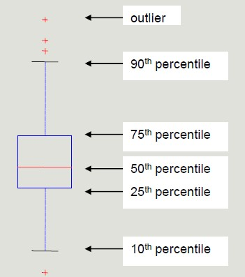
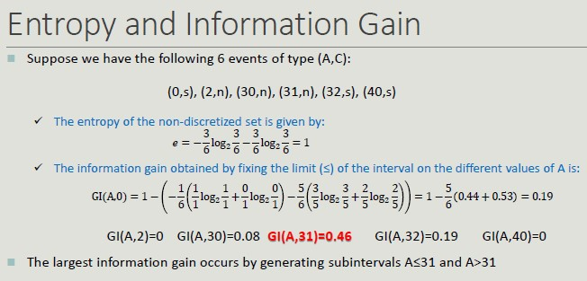
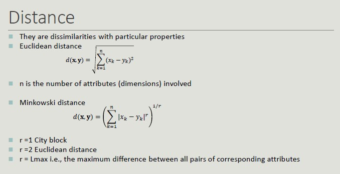
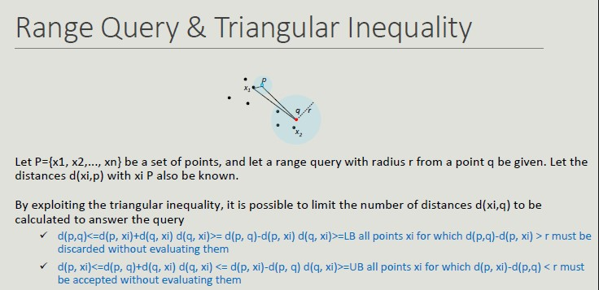
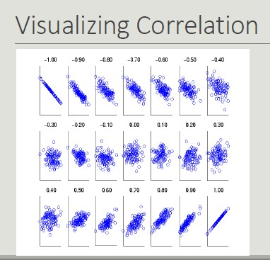

# Data Understanding & Preparation

In data mining, data are composed of collections of objects described by a set of attributes (we refer to data that can be stored in a database).

**Attribute:** property characteristic of an object

## Attribute types

In order to perform meaningful analysis, the characteristics of the attributes must be known. The **attribute type** tells us what properties are reflected in the value we use as a measure. 

We can identify 4 types of attributes:

1. **Nominal**-qualitative: different names of value (gender, zip code, ID)
2. **Ordinal**-qualitative: values enables us to sort objects based on the value of attribute (grade)
3. **Interval**-quantitative: the difference between the values has a meaning, with a unit of measurement (dates, temperature)
4. **Ratio**-quantitative: the ratio of values has meaning (age, length, amount of money)

## Further classifications

- Binary, discrete and continuous
    - Discrete: finite number of infinite countable set of values
    - Continuous: real values

*Nominal and ordinal are typically discrete or binary, while interval and ratio attributes are continuous*
- Asymmetric attribute: only instances that take non-zero values are relevant
- Documents and Texts: objects of the analysis described by a vector of terms
- Transactions
    - Each record involves multiple items
    - Items come from a finite set
    - The number of items may vary from transaction to transaction
- Ordered data

## Explorative Analysis 
First step in business and data understanding. It refers to the preliminary analysis of the data aimed at identify its main characteristics. 

- It helps you choose the best tool for processing and analysis 

## STATISTICS OVERVIEW

### Frequency
The frequency of an attribute value is the percentage of times that value appears in the data set.

### Mode
The mode of an attribute is the value that appears most frequently in the data set.

### Percentile
Given an ordinal or continuous attribute x and a  number p between 0 and 100, the p-th percentile is the value of xp of x such that p% of the observed values for x are lower than xp.

Percentile visualization through boxplot enables the representation of a distribution of data. It can be used to compare multiple distributions when they have homogeneous magnitude.

### Mean
The mean is the most common measure for locating a set of points.

- Subject to outliers
- It is preferred to use tee median or a 'controlled' mean 

### Median
The median is the term occupying the central place if the terms are odd; if the terms are even, the median is the arithmetic mean of the two central terms.

### Range
Range is the difference between the minimum and maximum values taken by the attribute.

### Variance and Standard Deviation
Variance and SD are the most common measures of dispersion of a data set.

- Sensitive to outliers since they are quadratically related to the concept of mean

## Data Quality

The quality of the datasets profoundly affects the chances of finding meaningful patterns.
The most frequent problems that deteriorate data quality are:

- Noise and outliers (objects with characteristics very different from all other objects in the data set)
- Missing values (not collecting the data is different from when the attribute is not applicable), how to handle them:
    - Delete the objects that contain them
    - Ignore missing values during analysis
    - Manually/automatically fill the missing values
        - ML can be applied to fill the missing values by inferring the other values of that attribute and calculate the most appropriate value 
- Duplicated values (it may be necessary to introduce a data cleaning step in order to identify and eliminate redundancy)

## Dataset Preprocessing
Rarely the dataset has the optimal characteristics to be best processed by machine learning algorithms. It is therefore necessary to put in place a series of actions to enable the algorithms of interest to function:

- **Aggregation:** combine two or more attributes into one attribute
- **Sampling:** main technique to select data
    - Collecting and processing the entire dataset is too expensive and time consuming
    - Simple Random Sampling (same probability of selecting each element)
    - Stratified sampling (divides the data into multiple partitions and use simple random sampling on each partition)
        - Before sampling a partitioning rule is applied (we inject knowledge about the domain)
        - Allow the population to be balanced
        - However, we are applying a distortion
    - Sampling Cardinality: after choosing the sampling mode, it is necessary to fix the sample size in order to limit the loss of information
- **Dimensionality reduction:** the goal is to avoid the 'curse of dimensionality', reduce the amount of time and memory used by ML algorithms, simplify data visualization and eliminate irrelevant attributes and eliminate noise on data.
Curse of dimensionality: as dimensionality increases, the data become progressively more sparse. Many clustering and classification algorithms deal with dimensionality and distances. All the elements become equi-distant from one another; the idea of selecting the right dimension to carry out analysis is crucial.

The curve indicates that the more we increase the number of dimensionality, the smaller the ratio is.
In the modeling phase, it is important reduce dimensionality.

The goal is to reduce dimensionality and carry out analysis with the highest information amount.

- **Principal Component Analysis:** it is a projection method that transforms objects belonging to a p-dimensional space into a k-dimensional space in such way as to preserve maximum information in the initial dimension.
- **Attribute creation:** it is a way to reduce the dimensionality of data. The selection usually aims to eliminate redundant. 
We can use different attribute selection techniques:
    - Exhaustive approaches
    - Non-exhaustive approaches
    - Feature engineering (create new features): we have raw data and we can extract useful KPIs by designing new attributes.
- **Discretization and binarization:** transformation of continuos-valued attributes to discrete-valued attributes. Discretization techniques can be unsupervised (do not exploit knowledge about the class to which elements belong) or supervised (exploit knowledge about the class to which the elements belong).
    - Unsupervised: equi-width, equi-frequency, K-means

    - Supervised: discretization intervals are positioned to maximize the 'purity' of the intervals

**Entropy and Information Gain:** it is the measure of uncertainty about the outcome of an experiment that can be modeled by a random variable x.
The entropy of a **certain** event is zero.

The entropy of a discretization into n intervals depends on how pure each group.

**Binarization:** we start with a discrete attribute but we need it to be binary.

- **Attribute transformation:** function that maps the entire set of values of an attribute to a new set such that each value in the starting set corresponds to a unique value in the ending set. 

## Similarity and Dissimilarity

These two concepts are central in Machine Learning, as it is important to group clusters based on similarity and dissimilarity.

Some techniques are stronger with long distances while sometimes, by setting the wrong distance, we will incur in problems.

- **Similarity:** it is a numerical measure expressing the degree of similarity between two objects
    - Takes values in the range [0, 1]

- **Dissimilarity (distance):** it is a numerical measure expressing the degree of difference between two objects
    - Takes values in the range [0, 1] or [0, ∞]

## Distance

**Distance Properties**

Given two objects p and q and a dissimilarity measure d():

- d(p,q) = 0 only if p=q
- d(p,q) = d(q,p) -> *Symmetry* 
- d(p,r) + d(p,q) + d(q,r) -> *Triangular inequality*

**Similarity Properties**

Given two objects p and q and a similarity measure s():

- s(p,q) = 1 only if p=q
- s(p,q) = s(q,p) -> *Symmetry*

**Binary Vector Similarities**

It is common for attributes describing an object to contain only binary values.

- M01 = the number of attributes where p=0 and q=1
- M10 = the number of attributes where p=1 and q=0
- M00 = the number of attributes where p=0 and q=0
- M11 = the number of attributes where p=1 and q=1

**Cosine Similarity**

Like Jaccard's index. it does not consider 00 matches, but also allows non-binary vectors to be operated on.

**Similarity with Heterogeneous Attributes**

In the presence of heterogeneous attributes, it is necessary to compute the similarities separately and then combine them so that their result belongs to the range [0, 1]

## Correlation
The correlation between pairs of objects described by attributes (binary or continuous) is a measure of the existence of a linear relationship between its attributes.

