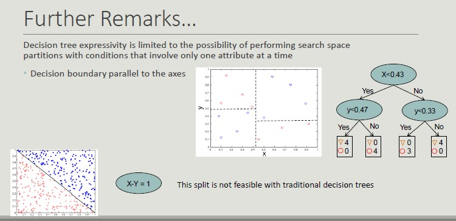
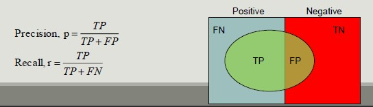

# Decision Tree

It is one of the most widely used classification techniques. It is simple, it can be trained with a limited number of examples, it is understandable and works well with categorical attributes.

The usage of this model is characterized by a set of questions (yes/no), which build the tree.
The idea is that the number of possible decision trees is exponential and we are looking for the best one (the one that creates the most accurate representation).

All the classification algorithms are systems that work in a multidimensional space ans try to find some regions that have the same types of object (belonging to the same class).



## Learning the Model

Many algorithms are available, but we will use **C4.5**.

**The Haunt's Algorithm**
It is a recursive approach that progressively subdivides a set of Dt records into purely pure record sets.

Procedure to follow:

1. If Dt contains records belonging to the yj class only, then it is a lea node with label *yj*
2. If Dt is an empty set, then t is a leaf node to which a parent node class is assigned
3. If Dt contains records belonging to several classes, you choose an attribute and a split policy to partition the records into multiple subsets.
4. Apply recursively the current procedure to each subset

```
TreeGrowth(E,F)
    if StoppingCond(E,F) = TRUE then
        leaf = CreateNode()
        leaf.label = Classify(E) ;
        return leaf;
    else:
        root = CreateNode();
        root.test cond = FindBestSplit(E,F) ;
        let V = {V | v is a possible outcome of root.test_cond}
    for each v ∈ V do
        E = {e | root.test cond(e)=v and e ∈ E}
        child = TreeGrowth(E,F);
        add child as descendant of root and label edge
    end for
    end if
        return root;
    end;

```

## Characteristic Feature
Starting from the basic logic to completely define an algorithm for building decision trees, it is necessary to define:

- The split condition (depends on the type of attribute and on the number of splits)
    - Nominal (N-ary split vs binary split)
    - Ordinal (partitioning should not violate the order sorting)
    - Continuous (the split condition can be expressed as a Boolean with N-ary split and as a binary comparison test with binary-split)
        - Static (discretization takes place only once before applying the algorithm)
        - DYnamic (discretization takes place at each recursion)
- The criterion defining the best split (it must allow you to determine more pure classes, using a **measure of purity**)
    - 
- The criterion for interrupting splitting (AND conditions, if one applies, the splitting stops)
    - When all its records belong to the same class
    - When all its records have similar values on all attributes
    - When the number of records in the node is below a certain threshold
    - When the selected criterion would not be statistically relevant
- Methods for evaluating the goodness of a decision tree

## Metrics for Model Evaluation

**Confusion Matrix** evaluates the ability of a classifier based on the following indicators:

- TP (true positive)
- FN (false negative)
- FP (false positive)
- TN (true negative)

**Accuracy** is the most widely used metric to synthesize the information of a confusion matrix


- **Accuracy Limitations**

Accuracy is not an appropriate  metric if the classes contain a very different number of records.

**Precision and Recall** are two metric used in applications where the correct classification of positive class records is more important

- **Precision** measures the fraction of record results actually among all those who were classified as such
- **Recall** measures the fraction of positive records correctly classified



**F-measure** is a metric that summarizes precision and recall

**Cost-Based Evaluation**
Accuracy, precision, recall and F-measure classify an instance as positive if P(+,i) > P(-,i).
They assume that FN and FP have the same weight, thus they are cost-intensive, but in many domains this is not true.


## ROC Space (Receiver Operator Characteristics)
Roc graohs are two-dimensional graphs that depict relative tradeoffs between benefits (TP) and costs (FP) induced by a classifier. We distinguish between:

- **Probabilistic classifiers** return a score that is not necessarily a *sensu strictu* probability but represents the degree to which an object is a member of one particular class rather than another one
-**Discrete classifier** predicts only the classes to which a test object belongs


## Classification Errors

- **Training error:** mistakes that are made on the training set
- **Generalization error:**  errors made on the test set
- **Underfitting:** the model is too simple and does not allow a good classification or set training or test set
- **Overfitting:** the model is too complex, it allows a good classification of the training set, but a poor classification of the test set
    - Due to noise (the boundaries of the areas are distorted)
    - Due to the reduced size of the training set

**How to handle overfitting**

- Pre-pruning: stop splitting before you reach a deep tree. A node can be split further if:
    - Nodes does not contain instances
    - All instances belong to the same class
    - All attributes have the same values
- Post-pruning: run all possible splits to reduce the generalization error

Post-pruning is more effective but involves more computational cost. It is based on the evidence of the result of a complete tree.

## Estimate Generalization Error

A decision tree should minimize the error on the real data set, unfortunately during construction, only the training set is available.

The methods for estimating the generalization error are:

- Optimistic approach
- Pessimistic approach
- Minimum Description Length (choose the model that minimizes the cost to describe a classification)
- Using the test set

## Building the Test Set

- **Holdout:** use 2/3 of training records and 1/3 for validation
- **Random subsampling:** repeated execution of the holdout method in which the training dataset is randomly selected
- **Cross validation:** partition the records into separate k subdivisions, run the training on k-1 divisions and test the reminder, repeat the test k times and calculate the average accuracy
- **Bootstrap:** The extracted records are replaced and records that are excluded form the validation set. This method does not create a new dataset with more information, but it can stabilize the obtained results of the available dataset.

## C4.5 (J48 on Weka)
This algorithm exploits the GainRatio approach. It manages continuous attributes by determining a split point dividing the range of values into two.
It manages data with missed values and run post pruning of the created tree.


