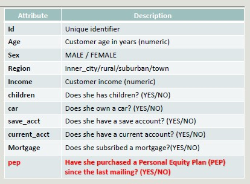
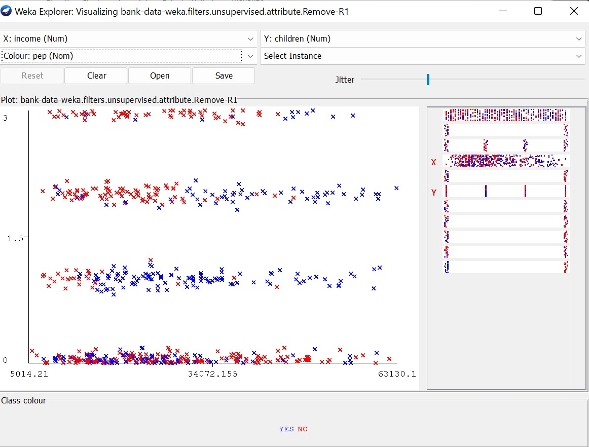
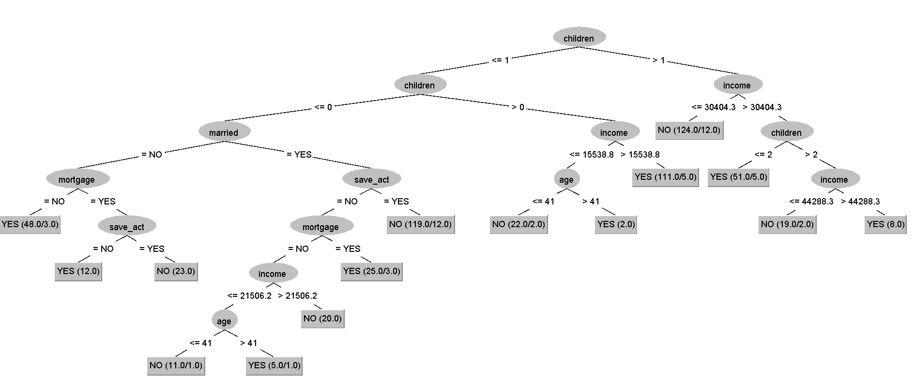

#  Bank Data

Attributes:

**PEP class** (Personal Equity Plan)

## Pre-Processing Bank Data

1. Load the files and save it in an ARFF format 
2. Carry out a visual analysis of the dataset
3. Drop the ID attribute 

Which attribute is more relevant for our analysis?

- Sex (no relevant difference)
- Age (not as relevant as income, but there is a trend)
- Married (relevant)
- Children (linear correlation, the first column does not respect the trend)

- Income (normal distribution)
    - The higher the income, the higher the probability to buy PEP

    

## Visualize the Plot Matrix

The higher the number of children, the lower the income as children cost a lot of money.

People without children are not interested in PEP as they do not need to think about the future. 

## Classify

Use the following algorithms and evaluate the result:

- J48
- J48 (without post-pruning)
- Jrip
- IBk (with k=1 and k=5)

The main variables are **children** and **income** (closest to the root).

KNN with k = 1 using the training set has an accuracy of 100% because the closest point to me is me (if given), so we drop it.

With IBk we are using a *distance function* so numbers should be discretized. 

Also, irrelevant and replicated attributes can create distortion in the result. 
- In this case, irrelevant attributes are most likely (sex, car)

We can drop the irrelevant attributes to increase accuracy.

