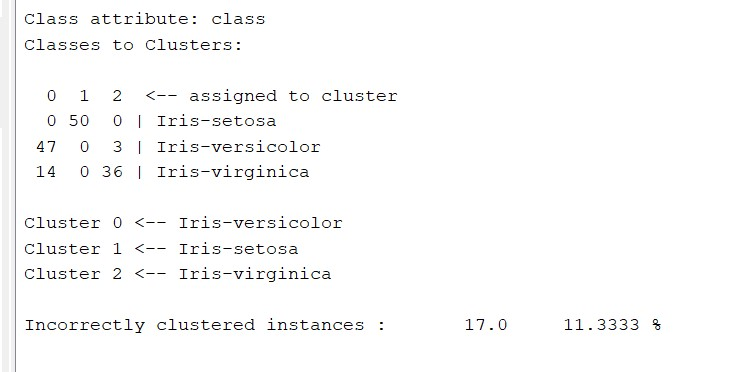
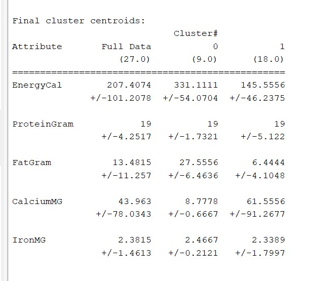

# Clustering with Weka

During the pre-processing part, the first thing to to do is to **normalize** the dataset (unsupervised filter) because clustering algorithms need a distance measure.

Then, we need to select the K-Means parameters:

- **DisplayStDev**: shows the standard deviation of the distances of individual points from the cluster center. The measure is reported separately for each attribute.
- **Distance Function**: distance function used in the calculation
- **Maxiteration**: maximum number of iterations to achieve convergence
- **NumCluster**: value of k
- **Seed**: random value for choosing the initial

We set the number of cluster at 3:

If we try with two clusters, the squared error is high (12.34), while with 4 clusters, the squared error is about 5.

By running the analysis with *class to cluster evaluation*, clusters are created based on their size.

We can improving the model by running the system in a two-dimensional space, selecting the two clusters with the lowest standard deviation.

## Food Nutrient Dataset

The dataset is composed by 25 foods with their nutritional information based on the following KPIs:

- Energy
- Protein
- Fat
- Calcium
- Iron

The goal is to distinguish, based on the data, which ones are **meat** and which ones are **fish**.

We run the cluster analysis using k-means:

 With two clusters, we can easily distinguish which cluster regards meat and which one is for fish.

 With three clusters, C0 remains unchanged while characterization between C1 and C2 is relevant only for proteins.

 

