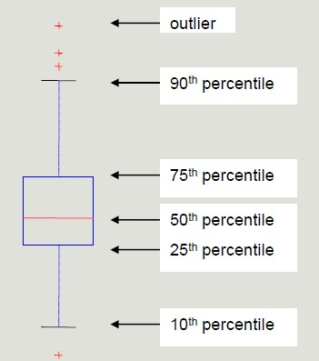
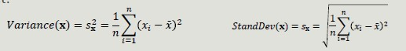

# Data Understanding & Preparation

In data mining, data are composed of collections of objects described by a set of attributes (we refer to data that can be stored in a database).

**Attribute:** property characteristic of an object

## Attribute types

In order to perform meaningful analysis, the characteristics of the attributes must be known. The **attribute type** tells us what properties are reflected in the value we use as a measure. 

We can identify 4 types of attributes:
1. **Nominal**-qualitative: different names of value (gender, zip code, ID)
2. **Ordinal**-qualitative: values enables us to sort objects based on the value of attribute (grade)
3. **Interval**-quantitative: the difference between the values has a meaning, with a unit of measurement (dates, temperature)
4. **Ratio**-quantitative: the ratio of values has meaning (age, length, amount of money)

## Further classifications

- Binary, discrete and continuous
    - Discrete: finite number of infinite countable set of values
    - Continuous: real values
*Nominal and ordinal are typically discrete or binary, while interval and ratio attributes are continuous*
- Asymmetric attribute: only instances that take non-zero values are relevant
- Documents and Texts: objects of the analysis described by a vector of terms
- Transactions
    - Each record involves multiple items
    - Items come from a finite set
    - The number of items may vary from transaction to transaction
- Ordered data

## Explorative Analysis 
First step in business and ata understanding. It refers to the preliminary analysis of the data aimed at identify its main characteristics. 
- It helps you choose the best tool for processing and analysis 

## STATISTICS OVERVIEW

### Frequency
The frequency of an attribute value is the percentage of times that value appears in the data set.

### Mode
The mode of an attribute is the value that appears most frequently in the data set.

### Percentile
Given an ordinal or continuous attribute x and a  number p between 0 and 100, the p-th percentile is the value of xp of x such that p% of the observed values for x are lower than xp.

Percentile visualization through boxplot enables the representation of a distribution of data. It can be used to compare multiple distributions when they have homogeneous magnitude.

### Mean
The mean is the most common measure for locating a set of points.
- Subject to outliers
- It is preferred to use tee median or a 'controlled' mean 

### Median
The median is the term occupying the central place if the terms are odd; if the terms are even, the median is the arithmetic mean of the two central terms.

### Range
Range is the difference between the minimum and maximum values taken by the attribute.

### Variance and Standard Deviation
Variance and SD are the most common measures of dispersion of a data set.
- Sensitive to outliers since they are quadratically related to the concept of mean

## Data Quality

The quality of the datasets profoundly affects the chances of finding meaningful patterns.
The most frequent problems that deteriorate data quality are:
- Noise and outliers
- Missing values
- DUplicated values

