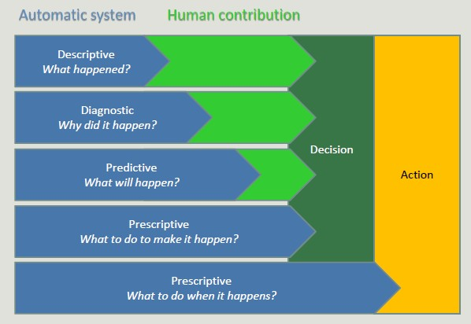
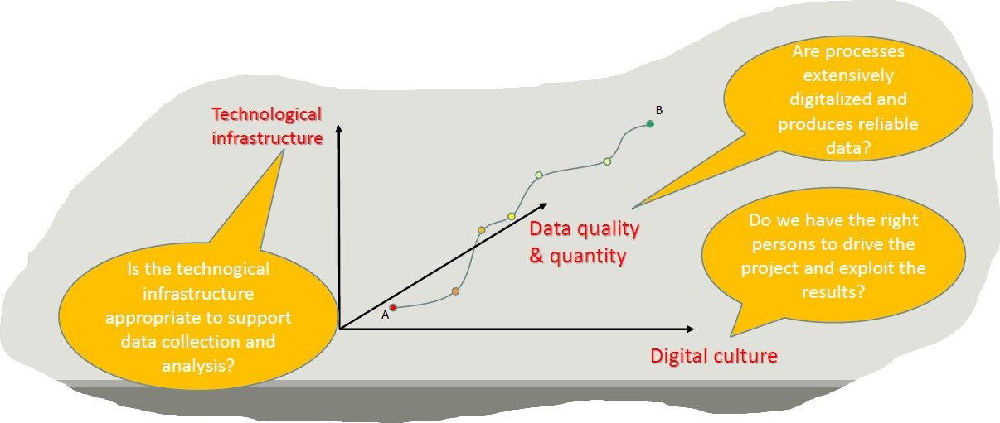

# Data Mining

The amount of data stored on computer is constantly increasing, coming from:
- IoT data
- Social data
- Data on purchases
- Banking and credit card transaction

The first step is to collect data in a data set. This step can be automated through artificial intelligence increasing the analytical power.

From on side, data is more and more and on the other side, hardware becomes more powerful and cheaper each day.

At the same time, managers are more and more willing to rely on data analysis for their business decisions.
The information resource is a precious asset to overcoming competitors. 

## Artificial Intelligence, Machine Learning and Data Mining

Although strongly interrelates, the term machine learning is formally distinct from the term Data Mining which indicates the computational process of pattern discovery in large datasets using machine learning methods, artificial intelligence, statistics and databases. 

## Data Mining - definition

Complex extraction of implicit, previously unknown and potentially useful data from the information.
Exploration and analysis, using automated and semi-automatic systems, of large amounts of data in order to find significant patterns through statistics. 

We do not just need to find results, but we need results to be USEFUL. 

## Analytics

ANalytics refers to software used to discover, understand and share relevant pattern in data.
Analytics are based on the concurrent use of statistics, machine learning and operational research techniques, often exploiting visualization techniques. 

Prescriptive systems generale much value but it is extremely complex. Companies should start simple, adopting simple descriptive analytics solutions, and then move on. 
It is risky to skip intermediate steps.

## BI adoption path

When we decide to digitalize a company, the adoption of BI solutions is incremental and rarely allows steps to be skipped.
This is because it is risky, costly and useless to adopts advanced solutions before completely exploiting simple ones. 

The goal is to create a **data-driven company**, where managers are supported by data. 
- Decisions are based on quantitative rather than qualitative knowledge.
- Process and knowledge are an asset of the company and are not lost if managers change

*The gap between a data-driven decision and a good decision is a good manager*

Adopting a data-driven mindset goes far beyond adopting a business intelligence solution and entails:
1. Create a data culture
2. Change the mindset of managers
3. Change processes
4. Improve the quality of all the data

**Digitalization** is a journey that involves three main dimensions:

