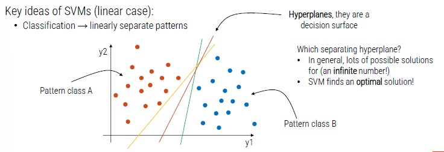

# Classification with Machine Learning

*How can machine learn?*

The key element is **data**: machine can learn from data.
This is the reason why data is so relevant today.

Currently, we can program machines that imitate this way of learning of humans.
Humans learn in many different ways and we only imitate just one with machines.

*Learning from data* is similar to humans that learn to paly a musical instrument:

- Observe how a chord is created (**annotated data**)
- Repeat the chord (**iterative learning process**)
- Feedback (**loss function**)

From a practical point of view, these are required steps:

1. We get the annotated data
2. We pre-process data (make them suitable for the algorithm)
3. We iteratively train a classifier
4. We measure the performance of the implemented solution

Machine Learning refers to the discipline that aims to develop systems able to automatically learn from (training) data and to generalize the knowledge on new (testing) data.

A machine learning model makes predictions without being explicitly programmed to do so.

Thanks to machine learning we can avoid complex operations of writing predefined instructions to solve a specific problem.

## Support Vector Machines (SVMs)

It is a **supervised** learning method used for classification, regression and outliers' detection.

It is effective with high dimensional inputs and still effective in cases where number of dimensions is greater than the number of samples.

We have a point with two dimensions (x, y) and two patterns (orange and blue).

SVM identifies a pattern (**hyperplanes**) that divides the cluster in two groups.

Hyperplanes are decision surface, there can be infinite possible solutions but SVM finds the optimal one.

**Support vectors:** data points that lie closest to the decision surface

- Data points most difficult to classify
- Directly influence the optimum location of the decision surface
- They are the element of the training set that would change the position of the dividing hyperplane if removed
- SVMs maximize the margin between support vectors
- The decision functions is fully specified by a subset of training samples, the support vectors
- This becomes a quadratic programming problem that is easy to solve by standard methods

*What if patterns are not linearly separable?*

The idea is to still obtain a linear separation by mapping the data to a higher dimensional space.
The mapping procedure is realized through a **kernel function.**

If we have more than two classes, we can adopt two solutions:

- **One-Against-One:** classifiers trained on all possible class couples
- **One-Against-All:** one SVM trained for each class (the SVM that has the better margin decides the final class)

## Linear and Non-linear Kernel

- If the dimensionality of the space is very high, linear SVM is generally used
- Fow low dimensionality, the primary choice is non-linear SVM with RBF kernel
- For medium dimensionality both types are generally tried

Remember, the hyperparameter are calibrated on a separate validation set, or through cross validation.

## Decision Trees

Tree-like model to perform the classification.
They are commonly used in operational research, specifically in decision analysis.

If we add a class, we need to add another decision **node**.

**Decision Tree Training**

The **root node**:

- We want a decision that makes a good split (separating classes as much as possible)
- Quantify a good split by using a **measure** (Gini index, entropy ..)
- Different possible algorithms that recursively evaluate different features and use at each node the feature that best splits the data

The **second node**:

- Let's go the left branch
- We use only data that belong to the left branch
- We do the same thing we did in the root node
- We apply this procedure to all the other nodes

We stop the training when the selected measure is not further increased after some iterations.

**Ensemble Methods**

A multi-classifier is an approach where several classifiers are used together, wither in parallel or in cascade.

It has been shown the use of combinations of classifiers can strongly improve performance.
The combination is effective only when individual classifiers are **independent**.
Unfortunately, it is very difficult to have real independence between classifiers.

Two approaches:

- **Bagging**: I train different classification algorithms on different portions of the training set
- **Boosting**: I train different algorithms on incorrectly classified patterns

How to merge decisions of the individual classifiers:

1. **Decision level**
    - Majority vote rule (each classifier vote for a class and the pattern is assigned to the highest rated class)
    - Borda count (each classifier produces a ranking of the classes, the rankings are converted into scores and the class with the highest final score is the one chosen)

2. **Confidence Level**
    - Each classifier outputs a confidence value, and these values are merged
    - Weighted sum (the sum of the confidence values is performed by weighting the different classifiers according to their degree of skill)
    - The sum is often preferable to the product as it is more robust (in the product it is sufficient that a single classifier indicates zero confidence to bring the confidence of the multi classifier to zero)

**Random Forest** - based on Bagging

The single classifier on which random forest is based is the **decision tree** (hundreds or thousands of DT).

In random forests, we have two types of bagging:

- **Data Bagging** (RF repeatedly selects a random sample with replacement of the training set and fits trees to these samples)
- **Feature bagging** (in each decision node, the choice of the best feature on which to partition is not made on the entire set of *d* feature)

The final decision is taken upon the **majority vote rule**.

**Adaboost** - based on boosting

Several weak classifiers are combined together to obtain a strong classifier.
Differently from bagging, there is an incremental learning phase, at each step a weak classifier is added.

