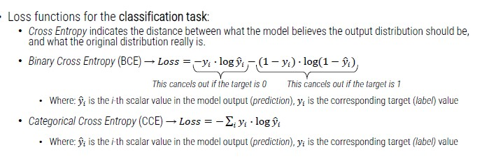
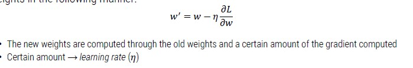

# Classification with Deep Learning

Deep learning is a discipline, similar to ML, that allows you to avoid the problematic phase of feature extraction with high-dimensional input.

Is is based on **neural networks** (NNs) classifier.
The key idea is to imitate, as far as possible, he nature (neurons in the human brain).

The first Artificial Neuron has been introduced in 1943 by McCulloch and Pitts.
In artificial neuron, there are:

- Inputs (digital numbers)
- Inputs are weighted (not all inputs are equally important)
- Inputs are merged with a sum function (plus a *bias*)
- An **activation function** is used to generate the final output

## Activation Function

The activation function defines the output of that node given an input or set of inputs.
They are a sort of switch of the artificial neuron; they output a small value for small inputs and a larger value if its inputs exceed a threshold.

**Liner vs Non-linear problems**

A single artificial neuron can solve only **linear** problems.

The solution is to use more ANs organized on different layers (**Multi Layer Perceptron**).
It is not easy as it introduces several mathematical problems, besides, we greatly improve the computational load.

## Artificial Neural Networks

Groups of artificial neurons are organized in different **layers**: neural networks.

Typically, they present:

- An input layer (input of the network)
- An output layer (output of the network)
- One or more **hidden layers**

Each neuron is **fully connected** with those of the next level.
Again, we try to imitate the hierarchical nature of our neurons:

- We have only ten levels between the retina and the actuator muscles.
- Otherwise, we would be too slow to react to stimuli.

**ANN Typologies**

- **Feedforward** (FF): the connections connect the neurons if one level with the neurons of the next level.
    - Connections to the same level and backward connections are not allowed.
    - It is by far the most used type of network.
- **Recurrent**: feedback connections are expected (towards neurons of the same level but also backward).
    - More suitable for the management of sequences because they have a short-term memory effect

**Neural Networks Training**

General considerations about NN layers:

- Greater number of hidden layers (and neurons) -> better performance
- Greater number of hidden layers (and neurons) -> need for more training data
- Greater number of hidden layers (and neurons) -> greater computational load

*How is it possible to train a neural network?*

Training a neural network is extremely complicated, but we can use specific frameworks:

- PyTorch
- TensorFlow
- Mxnet

Inside the neural network, we can change the weights applied to each input.

Training a NN means **minimizing** the loss function.
The cost function:

- It is a mathematical formulation of the learning goal
- It measures the error between the prediction and the ground truth
- Presents the performance in the form of a single real number

*How to minimize the loss?* -> adjusting the weights and the bias of every neuron

We can change weights and bias following **gradients** (the derivative of a function measures the sensitivity to change of the function value with respect to a change in its argument).

We can minimize the loss function with a gradient descent approach that adjust weights in the following manner:

