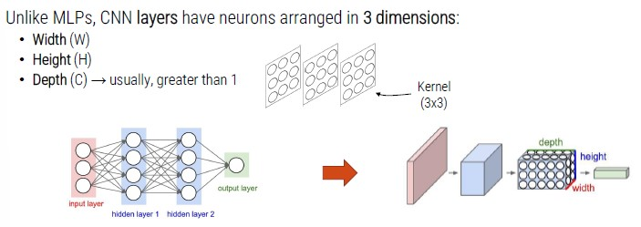
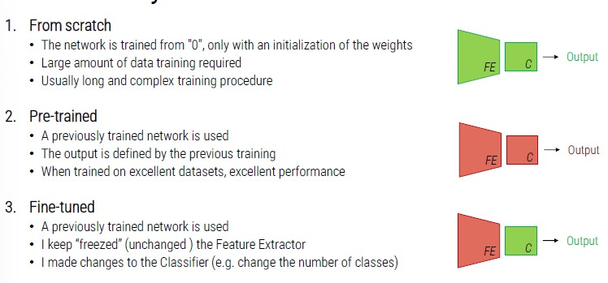

# Convolutional Neural Networks

CNNs are particular Neural Networks specifically designed to process images.
Instead of using a flat structure, it arranges neurons on three dimensions.

How is it possible to connect a 3D input with a **kernel**?

To do so, we need a mathematical operation called **convolution**.
The convolution is the core building block of convolutional neural networks.

Each kernel is convolved with the input volume thus producing a 2D feature map.
With this process, one feature map for each kernel is produced.

We usually have more than one kernel as output is usually larger than 1.
The output volume is then made up by stacking together all activation maps produced on the top of the other.

## CNN Architecture

In multi-layers architecture we have a flat structure with different layers.

With CNN, we have a bunch of layers stacked one on the top of the other:

Differently from HOG, CNN automatically learn how to extract features, so there is no need to specify parameters.

Convolutional layers learn to extract various types of visual information in a hierarchical manner:

- In the layers close to the input, CNNs learn filters to extract 'simple' visual information.
- In the layers placed in depth, the filters extract semantically complex visual information.

The interesting thing is that this mechanism seems similar to what happens in our **brain**, where the visual cortex processes information by different layers.

## Pooling Layer

Pooling layers spatially subsample the input volume (reduce the input size).
They are widely used for a number of reasons:

- Gain robustness to exact location of the features
- Reduce computational cost
- Help preventing over-fitting
- Increase receptive field of following layers

## Other Layers

**Activation layer**: activation function used with neural networks.

**Flatten layer**: usually exploited to connect the 3D feature extractor to the 1D classifier (like MLP wih *unrolled* img).

It is possible to build a personalized architecture but it is very complex so, we will use already implemented ones:

- AlexNet
- ResNet
- VGG

## Train CNNs

CNNs can be trained in different ways:

