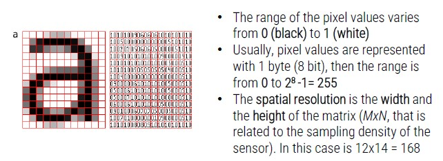

# Data Types

In general, there are 4 types of data:

1. **Numerical:**
    - Values associated with measurable characteristics
    - Continuous (subject to ordering)
    - Representable as numerical vectors
2. **Categorical:**
    - Qualitative characteristics
    - Presence or absence of a characteristic
    - Sometimes subject to sorting
    - Widely used in Data Mining
3. **Sequences:**
    - Sequential patterns with spatial or temporal relationships
    - With a variable length
    - Position in the sequence and relationship with predecessors and successors are important
4. **Structured data:**
    - Outputs organized in complex structures such as trees and graphs

## Images

An image is a **matrix of values** in which each cell is referred as pixel and each pixel contains the value of the brightness.

In **color images**, each pixel contains 3 values that represent the color components, referred as channels.
The content of channels are related to the color space (the convention used to define colors).

- **RGB color space**: 3 values indicate the value of three components (Red, Gree and Blue).

## Image formats

