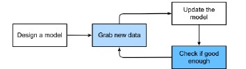
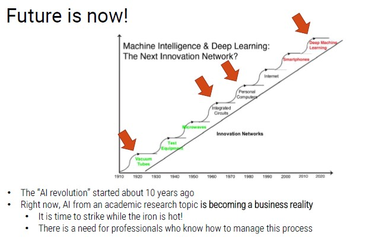

# Historical Evolution of AI

To understand why AI is so important today, we have to analyze the past.

In **1950** the enthusiasm for AI began:

- **Turing Test**: *"Can machines think?"*
- 1954: one of the main experiments in machine translation
- 1955: Arthur Samuel wrote a program that could play checkers very well
- 1957: Rosenblatt invented perceptrons, a type of neural network

**First AI Winter**  - promises of AI were exaggerated

In **1980** the Boom times occurred:

- Commercialization of new AI Expert Systems capable of reproducing human-decision making, through *"if-then-else"* rules
- Financial planning, medical diagnosis, geological exploration, and microelectronic circuit design

**Second AI Winter** - many tasks were too complicated for engineers

In **2012** the Deep Learning revolution took place

- Solved mathematical problems
- New powerful Neural Networks
- Huge improvement with the computational power
- Introduction of GPUs

Problem with **data**

- AI models need huge amount of training data
- Currently, we are able to:
    - Acquire a lot of data (IoT)
    - Store huge amount of data (improved storage)

Today, the question is not if we are able to collect data, but if we are able to use them.

