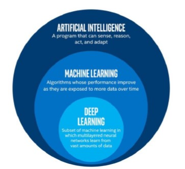

# Introduction to Machine Learning

What are the main features of intelligence?

*Intelligence is a very general mental capability that, among the other things, involves the ability to reason, plan, solve problems, think abstractly, comprehend complex ideas, learn quickly and learn from experience.*

**Artificial Intelligence** is a huge set of disciplines which also includes machine learning.
With machine learning, we refer only to a [small subset](https://medium.com/@terdsaksu/artificial-intelligence-machine-learning-deep-learning-a2ebd43ff1b2) inside artificial intelligence.

We, as humans, take many activities for granted that for machines would be very complex. 
Simulating human intelligence is extremely complex as our brain in an incredibly sophisticated machine, of which we still know few aspects.

