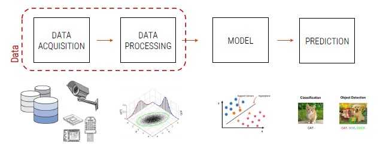

# Introduction to Machine Learning

What are the main features of intelligence?

*Intelligence is a very general mental capability that, among the other things, involves the ability to reason, plan, solve problems, think abstractly, comprehend complex ideas, learn quickly and learn from experience.*

**Artificial Intelligence** is a huge set of disciplines which also includes machine learning.
With machine learning, we refer only to a [small subset](https://medium.com/@terdsaksu/artificial-intelligence-machine-learning-deep-learning-a2ebd43ff1b2) inside artificial intelligence.

We, as humans, take many activities for granted that for machines would be very complex. 
Simulating human intelligence is extremely complex as our brain in an incredibly sophisticated machine, of which we still know few aspects.

## Impact of AI in our world

For both graphs, we can not the exponential trend and the variety of continents covered. 

*Information is the oil of 21st century, and analytics is the combustion engine*

The number of requests per position as data scientist is constantly increasing as companies need to extract knowledge from data to survive.

The revolution introduced by AI is reflected also in companies. At least 5 of the top 10 world companies are directly related to AI.
Also, at least 2 companies are directly related to the production of chips, key elements for AI.

**Nvidia**

It is a software and fabless company that design GPUs, which nowadays are essential to:

- Create AI models
- Perform High Performance Computing (HPC)

Nvidia is the leading company in the sector and this is the reason why its shares has risen significantly in recent years.

## The General Paradigm of Machine Learning

**Machine Learning** is a subset of the AI field that tries to develop systems able to automatically learn from specific examples (*training data*) amd to generalize the knowledge on new samples (*testing data*) of the same domain.

From a practical point of view:

1. We have some data which represents our application domain
2. We implement an algorithm able to learn from the data (training phase)
3. We use data to understand if the trained model has learned something -> **model deployment**

The main steps for the development of intelligent systems based on ML:

**Data Acquisition**

Data is the founding element of any application related to ML. Acquiring large amounts of data is one of the main concerns for top-companies today.

**Data Processing**

All those techniques with which data are processed in order to adapt them to the best of the ML model that we plan to develop.

**Model**

This is the main core of AI systems. A model can be seen as a set of mathematical and statistical technique able to learn from a certain distribution of data provided in input and to generalize on new data.

**Prediction**

It can take many forms depending on the application developed. It is the output of the model and it is important to evaluate the effectiveness of the developed system.
