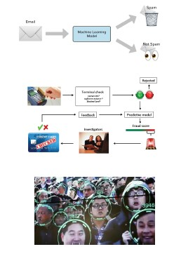
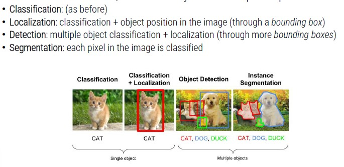

# Model

The model is the heart of the AI in our system.
It is one of the most delicate and decisive elements of the entire process:

- **Model** -> mechanism with which input data are transformed in outputs

## Machine Learning Tasks

There are different tasks in ML depending on the output we want:

- Classification
- Regression
- Clustering

## CLassification
    - We have a specific input, a model (classifier) which outputs a class (pattern)
    - If there are only 2 classes, we call the problem *binary* classification, while with multiple classes, we have *multi-class* classification

**class** = data set having common properties

The concept of *label* and *semantic* is related to the concept of class, since it strictly depends on the working context.

**Examples of classification:**

1. Spam detection
    - Input: email texts
    - Output: yes/no (spam)
2. Credit card fraud detection
    - Input: list of bank operations
    - Output: yes/no (fraud)
3. Face recognition
    - Input: images
    - Output: identity
4. Medical diagnosis
    - Input: x-ray images
    - Output: benign/malignant (tumor)

## Regression

Given a specific input, the model (regressor) outputs a continuous value (data -> value).
You can see a regression task as a classification task with a high number of classes

**Examples of regression**

1. Estimation of a person's height based on weight
2. Estimated sale prices of apartments in the real estate market
3. Risk estimation for insurance companies
4. Energy prediction produced by a photovoltaic system
5. Health costs prediction models

## Clustering

Identify groups (clusters) of data with similar characteristics, usually applied in an **unsupervised** learning setting (patterns are not labeled and classes are not known in advance).

Usually, the unsupervised nature of the problem makes it more complex than classification.

**Examples of clustering**

1. Marketing (user groups)
2. Genetics (group by DNA)
3. Bioinformatics (partitioning of genes)
4. Vision (unsupervised segmentation)

## Artificial Vision

For artificial vision domain, we can identify even more specific problems

